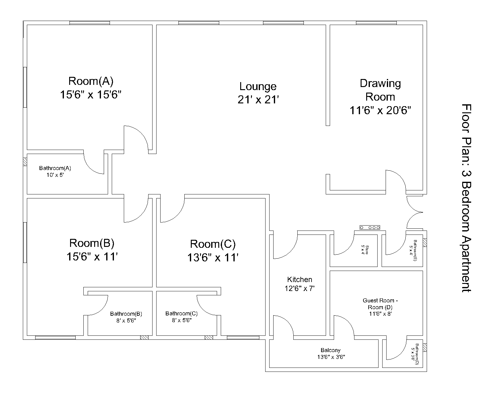

# Lighting and Cabling Scheme Design for Residential Load
## Prepared as an end-of-semester Complex Engineering Problem-based project for Electrical Power Distribution and Utilization (EE-359) at the department of Electrical Engineering, NEDUET.

For more details, please see the [project report](./epdu-cep-report.pdf).

## Group Members

| Name|Roll Number|
|-----|----|
|Saad Mashkoor Siddiqui|EE-16163|
|Faiq Siddiqui|EE-16164|
|Malik Zain-ul-Hassan|EE-16171|

From Section D, TE-EE 16-17, Fall '19 Semester

## Overview
An apartment was modelled as a residential electrical load for the purpose of proposing a lighting, cabling, and elementary distribution board design in accordance with IEC standards. DIALux Evo was then used to
1. Site survey and load assessment
2. AutoCAD modelling of the loads floor plan (2D)

3. 3D modelling of the load in DIALux Evo
	- 2D to 3D transformation.
	- Addition of furniture and textures.
	- Modelling windows, doorways, and other sources openings.
4. Lighting Scheme Design
	- Luminaire Selection from built-in Philips Luminaire Catalog 
	- Standardised lux level lookups for different rooms.
	- Luminaire placement to achieve uniform lux levels based on lux contours. 

5. Cabling Scheme Design
	- HT and LT cable length approximation.
	- Cable selection from Pakistan Cables Catalog using
		- Ampacity
		- Estimated voltage drops
		- Short circuit rating
6. Distribution Board Design
	- Load balancing across all three phases.
	- Mapping individual loads to circuit breakers. 
	- Breaker sizing based on rated ampacity.